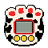

<table>
  <thead>
    <tr>
      <th style="background-color:#f2f2f2; padding:8px;"></th>
      <th style="background-color:#f2f2f2; padding:8px;"></th>
      <th style="background-color:#f2f2f2; padding:8px;">Other Shells</th>
      <th style="background-color:#f2f2f2; padding:8px;">Image</th>
       <th style="background-color:#f2f2f2; padding:8px;">Rarity</th>
       <th style="background-color:#f2f2f2; padding:8px;">Type</th>
    </tr>
  </thead>
  <tbody>
    <tr>
      <td style="padding:8px;">
        
      </td>
      <td style="padding:8px;">My Pet (マイペット) Release: 🇯🇵 1997? 
        Programming: Original 
        This was a UFO catcher toy that was never sold through traditional retail.</td>
       <td style="padding:8px;">
      
      </td>
      <td style="padding:8px;">🖼️</td>
      <td style="padding:8px;">💎</td>
       <td style="padding:8px;">🐶</td>
    </tr>
    <tr>
      <td style="padding:8px;">
        
      </td>
      <td style="padding:8px;">The Puppy Release: 🇯🇵 1997? Programming: Original</td>
       <td style="padding:8px;">🖼️</td>
      <td style="padding:8px;">🖼️</td>
      <td style="padding:8px;">💎</td>
       <td style="padding:8px;">🐶</td>
    </tr>
        <tr>
      <td style="padding:8px;">
        
      </td>
      <td style="padding:8px;">Lovely Puppy Release: 🇯🇵 1997? Programming: Original</td>
      <td style="padding:8px;">🖼️</td>
      <td style="padding:8px;">🖼️</td>
      <td style="padding:8px;">💎</td>
       <td style="padding:8px;">🐶</td>
    </tr>

     <table>
  <thead>
    <tr>
      <th style="background-color:#f2f2f2; padding:8px;"></th>
      <th style="background-color:#f2f2f2; padding:8px;"></th>
      <th style="background-color:#f2f2f2; padding:8px;"></th>
      <th style="background-color:#f2f2f2; padding:8px;"></th>
       <th style="background-color:#f2f2f2; padding:8px;"></th>
       <th style="background-color:#f2f2f2; padding:8px;"></th>
    </tr>
  </thead>
  <tbody>
    <tr>
      <td style="padding:8px;">
        
      </td>
      <td style="padding:8px;">Penguin Watch ぺんぎんうぉっち / Pocket Penguin Release: 🇯🇵  
        Programming: Original I classified this under penguin due to the shell but it seems the sprites are not really penguin-esque at all. 
        </td>
       <td style="padding:8px;">
      
      </td>
      <td style="padding:8px;">🖼️</td>
      <td style="padding:8px;">💎</td>
       <td style="padding:8px;">🐧</td>
    </tr>
    <tr>
      <td style="padding:8px;">
        
      </td>
      <td style="padding:8px;">Penpy Release: 🇯🇵 1997? Programming: Original</td>
       <td style="padding:8px;">🖼️</td>
      <td style="padding:8px;">🖼️</td>
      <td style="padding:8px;">💎</td>
       <td style="padding:8px;">🐧</td>
    </tr>
        <tr>
      <td style="padding:8px;">
        
      </td>
      <td style="padding:8px;">Pingu & Pinga Chiisana Tomodachi ちいさなともだち Release: 🇯🇵 ? Programming: Original Company: Flex The name came be translated to "Little Friend" and the box states this is a "Communication Game". The shell is a flip open type.</td>
      <td style="padding:8px;">🖼️</td>
      <td style="padding:8px;">🖼️</td>
      <td style="padding:8px;">💎</td>
       <td style="padding:8px;">🐧</td>
       <tr>
                     <td style="padding:8px;">
        
      </td>
                <td style="padding:8px;">Yuki Penguin Release: 🇯🇵 ? Programming: Similar to Rakuraku Dinokun </td>
      <td style="padding:8px;">🖼️</td>
      <td style="padding:8px;">🖼️</td>
      <td style="padding:8px;">💎</td>
       <td style="padding:8px;">🐧</td>
    </tr>

    <table>
  <thead>
    <tr>
      <th style="background-color:#f2f2f2; padding:8px;"></th>
      <th style="background-color:#f2f2f2; padding:8px;"></th>
      <th style="background-color:#f2f2f2; padding:8px;">Other Shells</th>
      <th style="background-color:#f2f2f2; padding:8px;">Image</th>
       <th style="background-color:#f2f2f2; padding:8px;">Rarity</th>
       <th style="background-color:#f2f2f2; padding:8px;">Type</th>
    </tr>
  </thead>
  <tbody>
    <tr>
      <td style="padding:8px;">
        
      </td>
      <td style="padding:8px;">Nanja Monja Release: 🇯🇵  
        Programming: Original 
        </td>
       <td style="padding:8px;">
      
      </td>
      <td style="padding:8px;">🖼️</td>
      <td style="padding:8px;">💎</td>
       <td style="padding:8px;">🐶</td>
    </tr>
    <tr>
      <td style="padding:8px;">
        
      </td>
      <td style="padding:8px;">The Puppy Release: 🇯🇵 1997? Programming: Original</td>
       <td style="padding:8px;">🖼️</td>
      <td style="padding:8px;">🖼️</td>
      <td style="padding:8px;">💎</td>
       <td style="padding:8px;">🐶</td>
    </tr>
        <tr>
      <td style="padding:8px;">
        
      </td>
      <td style="padding:8px;">Lovely Puppy Release: 🇯🇵 1997? Programming: Original</td>
      <td style="padding:8px;">🖼️</td>
      <td style="padding:8px;">🖼️</td>
      <td style="padding:8px;">💎</td>
       <td style="padding:8px;">🐶</td>
    </tr>

